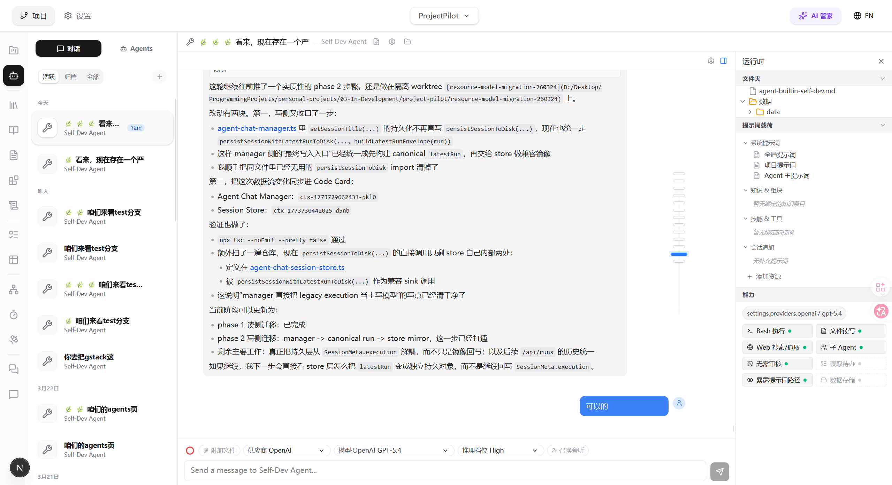
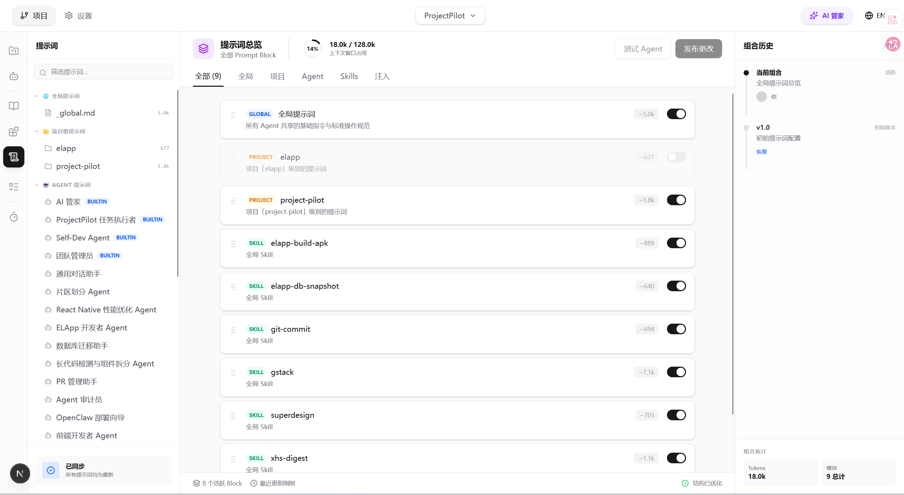
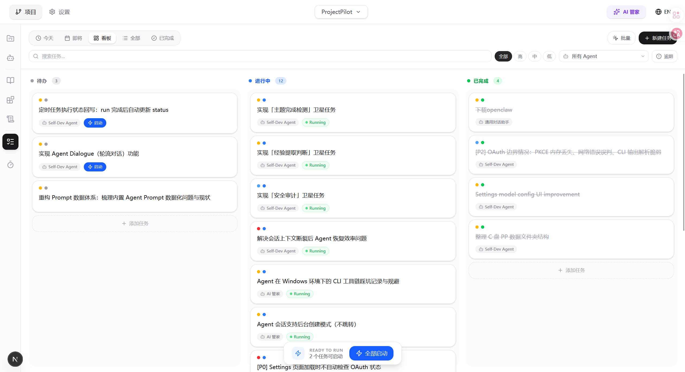

# ProjectPilot

> Builder's AI workbench — AI understands your project over time, not from scratch every turn; across engineering, product, design, business, growth, and ops — not only code.

<p align="center">
  
</p>

<p align="center">
  
  
</p>

[中文](#中文) | [English](#english)

---

## 中文

### ProjectPilot 是什么

**一句话**：Builder 的 AI 工作台 — 让 AI 对项目越来越懂，而不是每次从零开始；覆盖 Builder 多维度工作（不止代码）。

**产品叙事**：五模块飞轮（**Memory → Loader → Runtime → Distiller → Dashboard**）+ **六维项目结构**（工程 / 产品 / 设计 / 商业 / 增长 / 运营；大维度固定、小板块可演进）+ **Dashboard**（一屏总览与行动入口；设计稿与建设状态见 [`docs/design/product-direction-and-dashboard.md`](docs/design/product-direction-and-dashboard.md)）。

### 为什么存在

单次问答装不下真实 Builder 节奏：工程、产品、设计、商业、增长、运营会交织在一起。PP 用**本地优先**的编排与数据，把这些维度的上下文、执行与沉淀接进同一工作台，而不是让你每一轮对话都从零写背景。

### 一句话理解

- 对用户：**AI 记得你的项目**，少重复解释，多把时间花在决策与落地。
- 对产品：**Memory / Loader 负责懂**，**Runtime 负责做**，**Distiller 负责沉淀**，**Dashboard 负责看见全局**（实现进度以 [`docs/roadmap.md`](docs/roadmap.md) 为准）。

### 当前侧重的能力

- **多 Agent 与会话执行**：自定义 Agent、Guest、Butler；Claude / Codex 等运行时接入。
- **Loader 与 Resource**：对话前自动拼装项目、文档、技能与约束（ResourceRegistry）。
- **任务、触发与定时**：待办 / 事件触发 / Cron 与调度恢复（成熟度见路线图）。
- **文档与知识**：统一 `documents/` 与设计/知识形态；为 Distiller 铺路。
- **Claude Code 等 CLI 集成**：把重度编码工作交给外部工具链，PP 保持编排与上下文。
- **工作区与 Flow 视图**：从壳、项目、任务与会话多入口观察进展（Dashboard 目标态见设计文档）。

### 它适合什么场景

1. **软件开发**
   - 让 Agent 参与编码、修复、重构、文档和排查
2. **长期复杂任务**
   - 不是一次性问答，而是需要跨多轮持续推进的事情
3. **多 Agent 分工**
   - 不同 Agent 分别负责分析、执行、审查、整理
4. **知识型工作**
   - 研究、写作、设计、产品规划、问题诊断

### 不是什么

- 不是「聊天框即产品」的通用对话工具。
- 不是全功能 Jira/Notion 替代品。
- 不是默认把项目数据全量托管上云的 SaaS。

能力边界见 [`docs/design/product-boundary.md`](docs/design/product-boundary.md)。编排落盘仍围绕 `Project`、`Session`、`Task`、`Resource`、`Document`、`Agent` 等对象；领域模型以 [`docs/领域与数据.md`](docs/领域与数据.md) 为准。

### 快速开始

#### 环境要求

- Node.js 18+
- Git
- Claude Code CLI

#### 安装

```bash
git clone https://github.com/Kaine665/Project-Pilot.git
cd Project-Pilot
npm install
npm install -g @anthropic-ai/claude-code
npm run dev
```

打开 `http://localhost:4000`

#### 数据目录

- **与 `file-store` 对齐的仓库内索引**：[`docs/data-storage.md`](docs/data-storage.md)  
- **本机规范与现状**：`~/.project-pilot/README.md`、`数据文件夹现状.md`（不在 Git 内）

**对齐日期**：2026-03-31。

### 文档

- [AI 知识地图与多入口同步](docs/AI_AGENT_KNOWLEDGE_MAP.md)
- [数据目录（与 file-store 对齐）](docs/data-storage.md)
- [Agent Chat Architecture](docs/agent-chat-architecture.md)
- [Context System](docs/context-system.md)
- [AI Task Workflow](docs/ai-task-workflow.md)
- [Artifact Retry](docs/artifact-retry.md)
- [Frontend Design](docs/frontend-design.md)
- [I18N Guide](docs/I18N_GUIDE.md)

### 技术栈

- **Frontend**: Next.js 15 + React 19 + TypeScript + Tailwind CSS 4
- **AI Runtime**: Claude Code CLI / related agent runtime adapters
- **Storage**: File-based JSON persistence
- **I18N**: next-intl

### 贡献

1. Fork 仓库
2. 创建分支 `git checkout -b feature/your-feature`
3. 提交变更
4. 推送分支
5. 发起 PR

更多细节见 [CONTRIBUTING.md](CONTRIBUTING.md)。

### License

MIT，见 [LICENSE](LICENSE)。

---

## English

### What is ProjectPilot

**One-liner**: A **Builder's AI workbench** — AI understands your project over time, not from scratch every turn; across engineering, product, design, business, growth, and operations — **not only code**.

**Product story**: A five-module flywheel (**Memory → Loader → Runtime → Distiller → Dashboard**) + a **six-dimension project map** (same six pillars as above; top-level dimensions are fixed, sub-areas evolve) + **Dashboard** (single-screen overview and action surface; design and build status in [`docs/design/product-direction-and-dashboard.md`](docs/design/product-direction-and-dashboard.md)).

### Why it exists

One-off Q&A cannot carry a real builder cadence: engineering, product, design, business, growth, and ops interleave. PP connects context, execution, and capture across those dimensions in one **local-first** workbench, instead of rewriting background every session.

### In one sentence

- For users: **The system remembers your project** — less re-explaining, more deciding and shipping.
- For the product: **Memory / Loader to understand**, **Runtime to act**, **Distiller to capture**, **Dashboard to see the whole** (delivery status: [`docs/roadmap.md`](docs/roadmap.md)).

### Current capability focus

- **Multi-agent and session execution**: custom agents, guests, butlers; Claude / Codex and related runtimes.
- **Loader and resources**: assemble project, docs, skills, and constraints before each run (ResourceRegistry).
- **Tasks, triggers, and schedules**: todos / event triggers / cron with scheduler recovery (maturity in the roadmap).
- **Documents and knowledge**: unified `documents/` for design + knowledge shapes; groundwork for Distiller.
- **Claude Code and CLI integration**: heavy coding stays in external toolchains; PP keeps orchestration and context.
- **Workspace and flow views**: shell, project, tasks, and sessions as entry points (Dashboard target in the design doc).

### What it is not

- Not a generic “chat box first” assistant.
- Not a full Jira/Notion replacement.
- Not a SaaS that defaults to shipping all project data to the cloud.

See [`docs/design/product-boundary.md`](docs/design/product-boundary.md). Persistence still centers on `Project`, `Session`, `Task`, `Resource`, `Document`, `Agent`; domain truth in [`docs/领域与数据.md`](docs/领域与数据.md).

### Use Cases

1. **Software development**
   - Coding, debugging, refactoring, docs, investigation
2. **Long-running work**
   - Work that spans multiple sessions and iterations
3. **Multi-agent workflows**
   - Analysis, execution, review, coordination
4. **Knowledge work**
   - Research, writing, design, product planning, diagnosis

### Quick Start

#### Requirements

- Node.js 18+
- Git
- Claude Code CLI

#### Installation

```bash
git clone https://github.com/Kaine665/Project-Pilot.git
cd Project-Pilot
npm install
npm install -g @anthropic-ai/claude-code
npm run dev
```

Open `http://localhost:4000`

#### Data Directory

- **In-repo index aligned with `file-store`**: [`docs/data-storage.md`](docs/data-storage.md)  
- **On your machine**: `~/.project-pilot/README.md` and `数据文件夹现状.md` (not in git)

**Last aligned**: 2026-03-31.

### Documentation

- [AI knowledge map and multi-tool sync](docs/AI_AGENT_KNOWLEDGE_MAP.md)
- [Data directory (aligned with file-store)](docs/data-storage.md)
- [Agent Chat Architecture](docs/agent-chat-architecture.md)
- [Context System](docs/context-system.md)
- [Data Storage](docs/data-storage.md)
- [AI Task Workflow](docs/ai-task-workflow.md)
- [Artifact Retry](docs/artifact-retry.md)
- [Frontend Design](docs/frontend-design.md)
- [I18N Guide](docs/I18N_GUIDE.md)

### Tech Stack

- **Frontend**: Next.js 15 + React 19 + TypeScript + Tailwind CSS 4
- **AI Runtime**: Claude Code CLI / agent runtime adapters
- **Storage**: File-based JSON persistence
- **I18N**: next-intl

### Contributing

1. Fork the repo
2. Create a branch: `git checkout -b feature/your-feature`
3. Commit your changes
4. Push the branch
5. Open a PR

See [CONTRIBUTING.md](CONTRIBUTING.md) for details.

### License

MIT. See [LICENSE](LICENSE).
