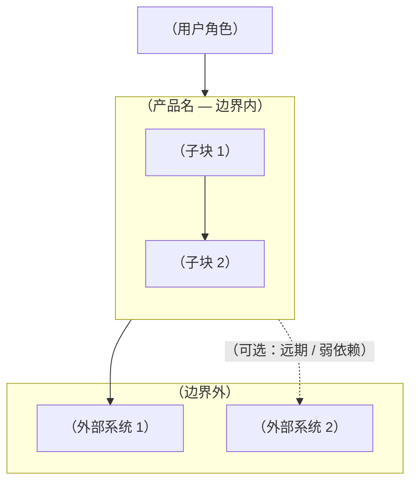
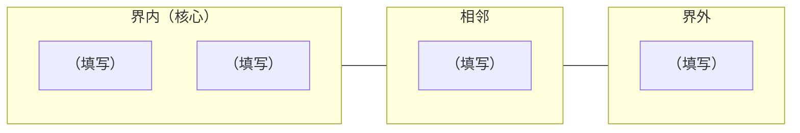

---
# 复制本文件为 product-boundary.md（或 product-boundary-<域>.md）后填写；勿直接改 TEMPLATE。
id: PRODUCT-BOUNDARY-YYYYMMDD-short-name
status: draft
title: （产品或子域名称 — 边界说明）
owner: （负责人，可 GitHub @）
author: （执笔）
reviewers: []
last_reviewed: YYYY-MM-DD
design_refs: []
contract_refs: []
as_is_refs: []
---

# （与 title 一致或更可读）

> **用法**：从本模板复制出新文件，删掉说明性注释，把 `（…）` 换成正文；需要画图时在 Mermaid 区块内改节点文案。与某次迭代强绑定时，在 `contract_refs` 里链到 `docs/contracts/`。

## 1. 产品是谁、为谁服务

- **产品 / 子域名称**：（填写）
- **目标用户画像**：（填写，可列 1～3 条）
- **典型使用场景**：（填写，可列 1～3 条）

## 2. 一句话边界

（用一句话说清：我们**是什么**、**不是什么**。）

## 3. 承诺范围（界内 — 我们会持续做好）

| # | 能力 / 主题 | 说明（可选） |
|---|-------------|--------------|
| 1 | （填写） | （填写） |
| 2 | （填写） | （填写） |

## 4. 相邻范围（集成、依赖，但非产品本体）

| # | 类型 | 说明 | 边界原则（我们与它的分工） |
|---|------|------|----------------------------|
| 1 | （如：CLI / API / 账号体系） | （填写） | （填写） |

## 5. 非目标（界外 — 默认不做；若做须单独立项）

| # | 非目标 | 原因或备注（可选） |
|---|--------|--------------------|
| 1 | （填写） | （填写） |

## 6. 核心闭环（可选 — 用业务语言描述主路径）

（例如：触发 → 分派 → 执行 → 记录 → 追踪。与 `docs/roadmap.md` 或领域文档中的流水线对齐时，在此写一句引用或简述。）

## 7. 上下文图（可选）

**读图提示**：（谁在用系统、系统内有什么、与外部如何交互 — 写一句即可。）

## 8. 能力分层图（可选）

## 9. 数据、隐私与信任边界（可选）

- **默认数据驻留**：（如：本地优先 / 云端 / 混合）
- **不上传 / 不同步**：（列出类别或示例）
- **可选项与开关**：（若有，链到专门 design，如凭据同步范围）

## 10. 相关文档

- Design：（列出 `docs/design/` 路径）
- As-is：（列出 `docs/as-is/` 路径）
- Contracts：（列出 `docs/contracts/` 路径，若有）
- 其他：（roadmap、数据规范等）

## 11. 何时重审

（例如：每季度 / 大版本前 / 新增企业功能时。）

## 修订记录

| 日期 | 变更 |
|------|------|
| YYYY-MM-DD | 从 `product-boundary-TEMPLATE.md` 复制并初填 |
