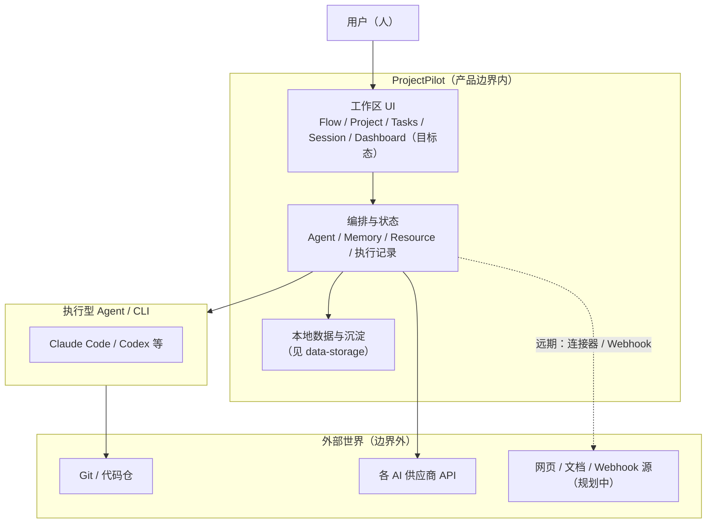

# ProjectPilot 产品与能力边界

**状态**：与 `[product-direction-and-dashboard.md](./product-direction-and-dashboard.md)` **同一套产品叙事**；本文只收**边界图、界内/相邻/界外、与路线图五段流水线**的对照，不写第二套定位话术。

---

## 一句话（唯一口径）

**Builder 的 AI 工作台** — 让 AI 对项目越来越懂，而不是每次从零开始；覆盖 Builder 多维度工作（不止代码）。

**产品叙事**：五模块飞轮（**Memory → Loader → Runtime → Distiller → Dashboard**）+ **六大固定维度**（工程 / 产品 / 设计 / 商业 / 增长 / 运营）+ **Dashboard**（设计稿与实现闸门见方向文档）。

---

## 图 1：产品上下文（谁在系统里、和谁打交道）

**读图**：人在边界内做决策与分派；Agent 与仓库、API 在边界外执行真实副作用；PP 负责编排、上下文、落盘与追踪。

---

## 图 2：能力边界（核心 / 相邻 / 明确不做）

```mermaid
flowchart LR
  subgraph IN["核心在界内"]
    A["多 Agent 与会话驱动执行"]
    B["Memory / Loader / Distiller / Dashboard 所承载的推进与总览"]
    C["Context / Resource / Prompt 注入"]
    D["项目级视图与本地沉淀"]
    E["Execution 记录（Event / Run）与可观测性"]
  end

  subgraph ADJ["相邻（可集成、非本体）"]
    F["CLI / IDE 工具链"]
    G["供应商模型与凭据（本机存储为主）"]
    H["账号与可选云同步（最小范围见 google-account-cloud-sync-scope）"]
  end

  subgraph OUT["明确不在界内（或远期单独立项）"]
    I["通用 IM / 社交协作"]
    J["全量云端文档协作默认"]
    K["替代 Jira/Notion 的全套 PM"]
    L["托管用户代码运行环境（默认）"]
  end

  IN --- ADJ
  ADJ --- OUT
```

---

## 边界表（验收时对照）

| 类别     | 含义                  | 典型包含                                                                                                                                        |
| ------ | ------------------- | ------------------------------------------------------------------------------------------------------------------------------------------- |
| **界内** | 产品承诺持续投入、文档与路线图优先描述 | Builder 工作台叙事下的多 Agent、Memory/Loader/Runtime/Distiller/Dashboard、Session、Project/Flow 视图、Resource 注入、本地执行记录、Trigger/Scheduler（成熟度见 roadmap） |
| **相邻** | 依赖或可选能力，边界上需清晰接口    | Claude/Codex/MCP、Git 工作区、API Key/凭据、Electron 壳、按类可选的云端凭据同步                                                                                  |
| **界外** | 默认不承担；若做则单独立项与风险提示  | 全量会话/文档上云、团队实时协同编辑、完整项目管理方法论工具包、通用搜索引擎/浏览器替代品                                                                                               |

---

## 与「五段流水线」的关系

`[roadmap.md](../roadmap.md)` 中的 **Trigger → Scope → Resource → Execution → Tracking** 是**界内能力的工程分解**：与方向文档中的 **五模块飞轮** 描述同一产品的不同切面（编排/数据流 vs 用户感知的记忆—执行—沉淀—总览）。

---

## 修订记录

| 日期         | 说明                                                                                                                |
| ---------- | ----------------------------------------------------------------------------------------------------------------- |
| 2026-04-10 | 初版：上下文图 + 能力边界图 + 对照表                                                                                             |
| 2026-04-12 | **唯一产品叙事**改为 Builder 工作台 + 五模块飞轮 + 六维度 + Dashboard；删除旧「本地优先任务推进系统」一句话边界；与 `product-direction-and-dashboard.md` 对齐 |

