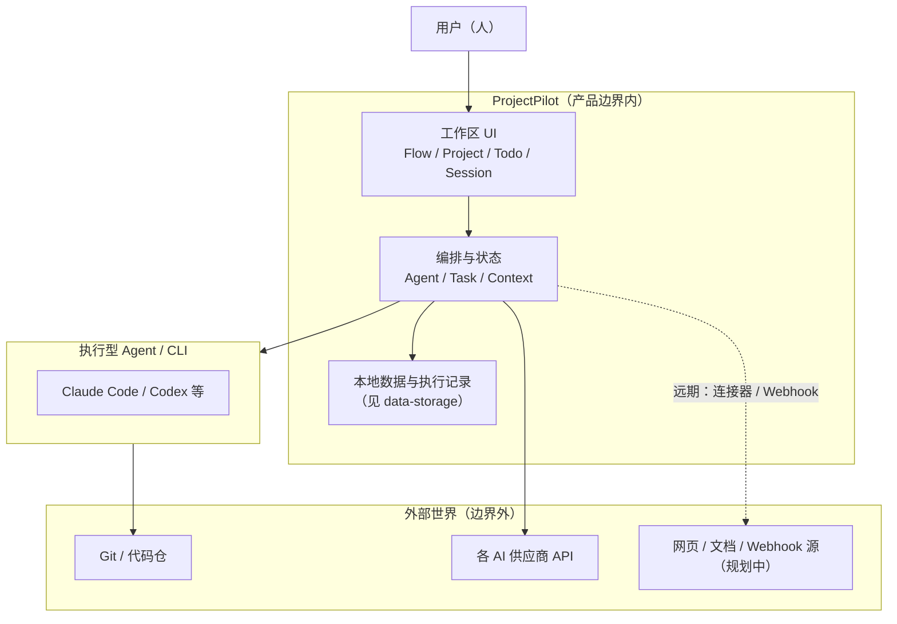

# ProjectPilot 产品边界

**状态**：产品定义（与实现可渐进对齐）。**对齐**：[`README.md`](../../README.md) 定位、[`roadmap.md`](../roadmap.md) 核心循环、[`领域与数据.md`](../领域与数据.md)。

## 一句话边界

ProjectPilot 是**本地优先的人与多 Agent 协作的任务推进系统**：以 **Task** 为主轴、**Project** 为工作域，把 **Trigger → Scope → Resource → Execution → Tracking** 连成可追踪的闭环；**不是**通用聊天框、**不是**全功能项目管理套件、**不是**云端协作优先的 SaaS。

---

## 图 1：产品上下文（谁在系统里、和谁打交道）

**读图**：人在边界内做决策与分派；Agent 与仓库、API 在边界外执行真实副作用；PP 负责编排、上下文、落盘与追踪。

---

## 图 2：能力边界（核心 / 相邻 / 明确不做）

---

## 边界表（验收时对照）

| 类别 | 含义 | 典型包含 |
|------|------|----------|
| **界内** | 产品承诺持续投入、文档与路线图优先描述 | 多 Agent、Task/Todo 推进、Session、Project/Flow 视图、Resource 注入、本地执行记录、Trigger/Scheduler（成熟度见 roadmap） |
| **相邻** | 依赖或可选能力，边界上需清晰接口 | Claude/Codex/MCP、Git 工作区、API Key/凭据、Electron 壳、按类可选的云端凭据同步 |
| **界外** | 默认不承担；若做则单独立项与风险提示 | 全量会话/文档上云、团队实时协同编辑、完整项目管理方法论工具包、通用搜索引擎/浏览器替代品 |

---

## 与「五段流水线」的关系

[`roadmap.md`](../roadmap.md) 中的 **Trigger → Scope → Resource → Execution → Tracking** 是**界内问题的分解框架**：边界图回答「我们为谁、与谁协作、不做什么」；流水线回答「界内能力如何串成闭环」。

---

## 修订记录

| 日期 | 说明 |
|------|------|
| 2026-04-10 | 初版：上下文图 + 能力边界图 + 对照表 |
