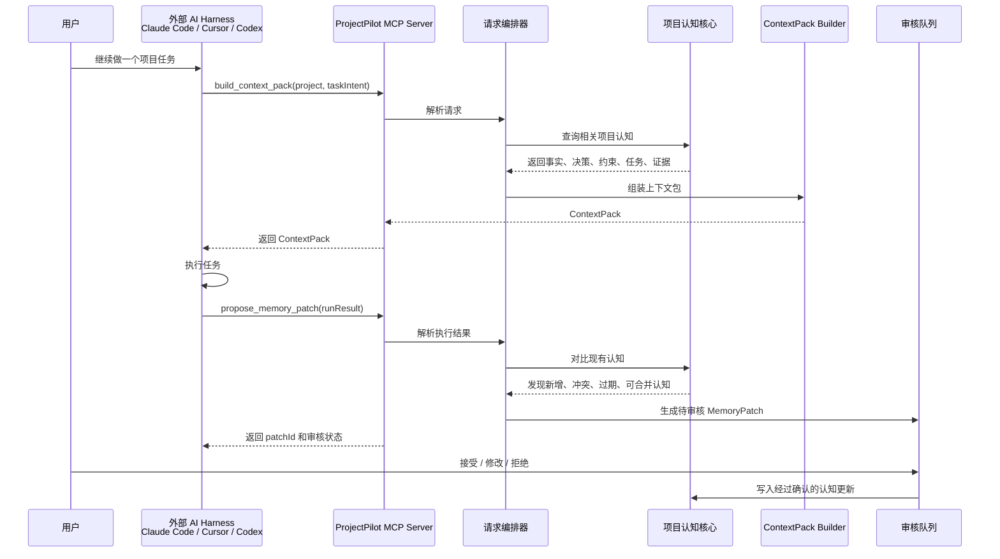
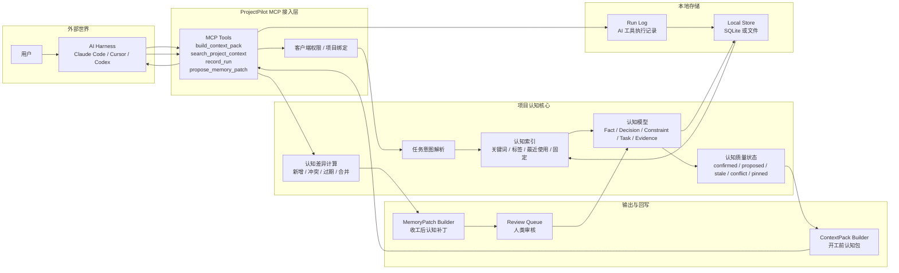
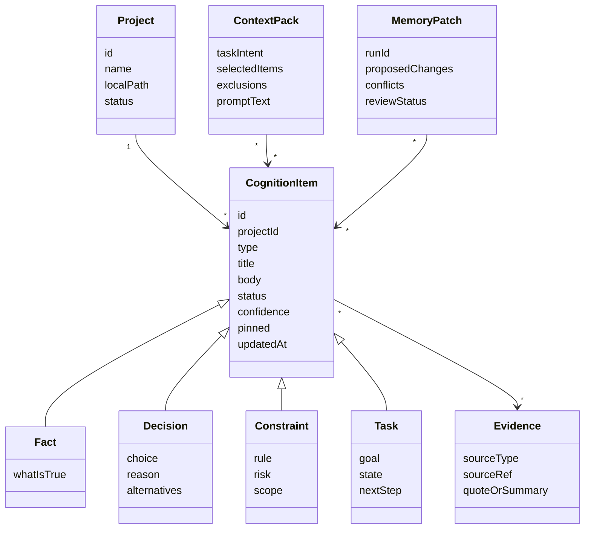

# 项目认知系统架构图

ProjectPilot 要设计的核心不是一个普通资料库，而是 **Agent 的项目认知结构**。

换句话说：

> 外部 AI harness 通过 MCP 询问项目时，ProjectPilot 要能判断“这次任务需要哪些项目认知”，并在任务结束后把新的认知更新纳入系统。

## 典型调用流程



## 内部处理架构



## 核心认知结构

第一版不需要大而全，只需要一个小而稳定的认知骨架。



## 开工前：build_context_pack

外部 AI harness 调用：

```text
build_context_pack(projectId, taskIntent)
```

ProjectPilot 内部处理：

```text
1. 解析 taskIntent
2. 找到相关 Fact / Decision / Constraint / Task / Evidence
3. 排除过期或冲突认知
4. 强制加入 pinned 认知
5. 压缩成 AI 可读的 ContextPack
6. 返回给外部 harness
```

返回内容示例：

```text
ContextPack
- 项目当前定位
- 这次任务相关背景
- 必须遵守的约束
- 相关决策与原因
- 当前任务状态
- 证据来源
- 执行结束后请回报哪些内容
```

## 收工后：propose_memory_patch

外部 AI harness 调用：

```text
propose_memory_patch(projectId, runResult)
```

ProjectPilot 内部处理：

```text
1. 解析 AI 执行结果
2. 提取候选 Fact / Decision / Constraint / Task 更新
3. 和现有认知比较
4. 标记新增、冲突、过期、可合并内容
5. 生成 MemoryPatch
6. 放入 Review Queue
7. 等用户审核后再写入长期认知
```

返回内容示例：

```text
MemoryPatch
- 新增事实：1 条
- 新增决策：1 条
- 更新任务：2 条
- 发现冲突：1 条
- 审核状态：pending
```

## 设计重点

ProjectPilot 真正要设计的是：

```text
项目认知如何被表示
项目认知如何被检索
项目认知如何被打包给 AI
项目认知如何被 AI 更新
项目认知如何被人类审核
```

这比“上下文地图怎么画”更底层。

UI 的任务，是让用户看见和修正这个认知系统。

